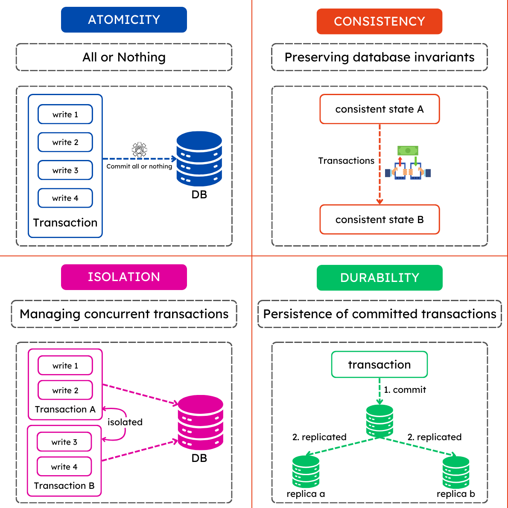

# MongoDB Interview Questions & Answers

## **Basic Questions**

### What is MongoDB, and how does it differ from relational databases?

MongoDB is a NoSQL database that stores data in JSON-like documents instead of tables. Unlike relational databases, it does not use fixed schemas and supports horizontal scaling.

### What are the key features of MongoDB?

-   Document-based storage
-   Schema-less design
-   High availability with replication
-   Horizontal scalability with sharding
-   Indexing for fast queries
-   Aggregation framework

### Explain the difference between MongoDB and MySQL.

| Feature      | MongoDB                              | MySQL               |
| ------------ | ------------------------------------ | ------------------- |
| Data Storage | JSON-like documents                  | Tables & Rows       |
| Schema       | Schema-less                          | Fixed Schema        |
| Scalability  | Horizontally scalable                | Vertically scalable |
| Transactions | Supports multi-document transactions | ACID-compliant      |

### What is a Document in MongoDB?

A document is a record stored in BSON format, similar to JSON. Example:

```json
{
    "name": "John Doe",
    "age": 30,
    "email": "john@example.com"
}
```

### What is a Collection in MongoDB?

A collection is a group of MongoDB documents, similar to a table in relational databases.

### How is data stored in MongoDB?

MongoDB stores data in collections as BSON (Binary JSON) documents.

```json
{
    "_id": "1234567890",
    "name": "John Doe",
    "age": 30,
    "email": "john@example.com"
    "address": {
        "street": "123 Main St",
        "city": "Anytown",
        "state": "CA",
        "zip": "12345"
    }
    "hobbies": ["reading", "hiking", "coding"]
}
```

### What is BSON, and how does it relate to JSON?

BSON is a binary representation of JSON, optimized for storage and speed. It supports more data types than JSON. BSON is used in MongoDB to store documents.

### How do you insert a document into a collection?

```javascript
db.users.insertOne({ name: 'Alice', age: 25 });
```

### How do you retrieve all documents from a collection?

```javascript
db.users.find();
```

### What is the difference between `findOne()` and `find()`?

-   `findOne()` returns a single document.
-   `find()` returns a cursor to iterate over multiple documents.

### How do you update a document in MongoDB?

```javascript
db.users.updateOne({ name: 'Alice' }, { $set: { age: 26 } });
```

### How do you delete a document from a collection?

```javascript
db.users.deleteOne({ name: 'Alice' });
```

### What are indexes in MongoDB, and why are they used?

Indexes improve query performance by allowing efficient data retrieval.

### How do you create an index in MongoDB?

```javascript
db.users.createIndex({ name: 1 });
```

## **Intermediate Questions**

### What is the Aggregation Framework in MongoDB?

A framework for data transformation and analysis.

```javascript
db.orders.aggregate([
    { $match: { status: 'shipped' } },
    { $group: { _id: '$customerId', total: { $sum: '$amount' } } },
]);
// output: { _id: 123, total: 1000 }
```

### What is replication in MongoDB?

Replication ensures high availability by copying data across multiple servers.
There are `primary`-secondary and replica-set configurations. Replica sets have a `primary` and multiple `secondaries`.
The `primary` handles writes, and secondaries handle reads. `Secondaries` can become primaries if the `primary` fails.

### How does MongoDB handle transactions?

MongoDB supports multi-document ACID transactions.

```javascript
const session = db.getMongo().startSession();
session.startTransaction();
db.users.insertOne({ name: 'Bob' }, { session });
session.commitTransaction();
```

### How do you perform pagination in MongoDB?

```javascript
db.users.find().skip(10).limit(10);
```

## **Advanced Questions**

### How does MongoDB ensure high availability and fault tolerance?

By using replica sets where one node acts as primary, and others as secondary.

### How does MongoDB handle ACID transactions?

By ensuring transactions across multiple documents using session-based operations.


### How does the `explain()` method help in query optimization?

`explain()` provides execution statistics and index usage information.

```javascript
db.users.find({ name: 'Alice' }).explain('executionStats');
```

### How do you manage user authentication and authorization in MongoDB?

Using role-based access control (RBAC) with authentication mechanisms like SCRAM.

```javascript
db.createUser({
    user: 'admin',
    pwd: 'password',
    roles: ['readWrite', 'dbAdmin'],
});
```

This document now includes detailed answers and code snippets for all MongoDB interview questions!

### How to use mongoose to commit transaction with graphql?

1. Define Mongoose Models

```javascript
const mongoose = require('mongoose');

const userSchema = new mongoose.Schema({
    name: String,
    email: { type: String, unique: true },
});

const profileSchema = new mongoose.Schema({
    userId: mongoose.Schema.Types.ObjectId,
    age: Number,
    bio: String,
});

const User = mongoose.model('User', userSchema);
const Profile = mongoose.model('Profile', profileSchema);
```

2. GraphQL Schema Definition

```javascript
type User {
  id: ID!
  name: String!
  email: String!
}

type Profile {
  id: ID!
  userId: ID!
  age: Int
  bio: String
}

type Mutation {
  createUser(name: String!, email: String!, age: Int, bio: String): User
}
```

3. Resolver with Mongoose Transaction

```javascript
const resolvers = {
    Mutation: {
        createUser: async (_, { name, email, age, bio }) => {
            const session = await mongoose.startSession();
            session.startTransaction();

            try {
                // Step 1: Create User
                const user = await User.create([{ name, email }], { session });

                // Step 2: Create Profile linked to User
                const profile = await Profile.create(
                    [{ userId: user[0]._id, age, bio }],
                    { session }
                );

                // Step 3: Commit Transaction
                await session.commitTransaction();
                session.endSession();

                return user[0];
            } catch (error) {
                // Rollback Transaction on Error
                await session.abortTransaction();
                session.endSession();
                throw new Error(`Transaction failed: ${error.message}`);
            }
        },
    },
};
```

**Key Points**

-   We use mongoose.startSession() to start a transaction.
-   The session is passed to all Mongoose operations to ensure atomicity.
-   commitTransaction() is called if all operations succeed.
-   If any operation fails, we call abortTransaction() to roll back changes.
-   We end the session after completing the transaction.
