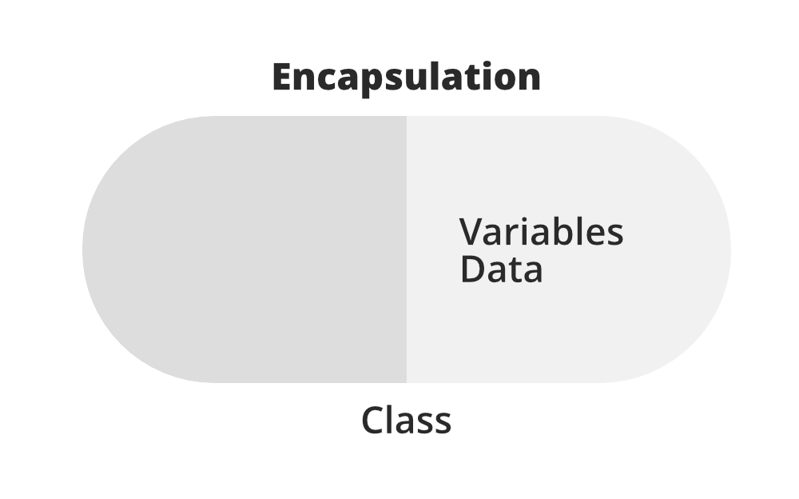
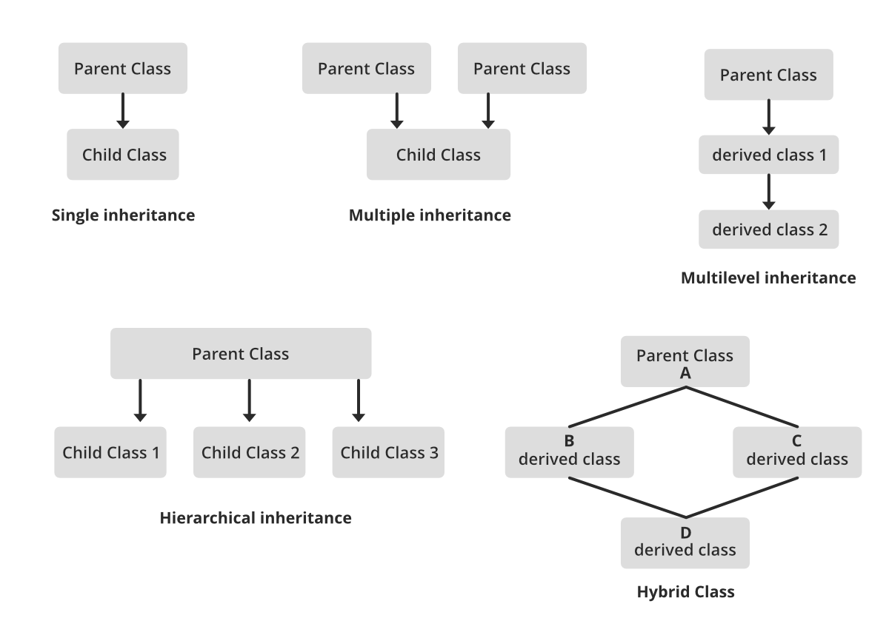
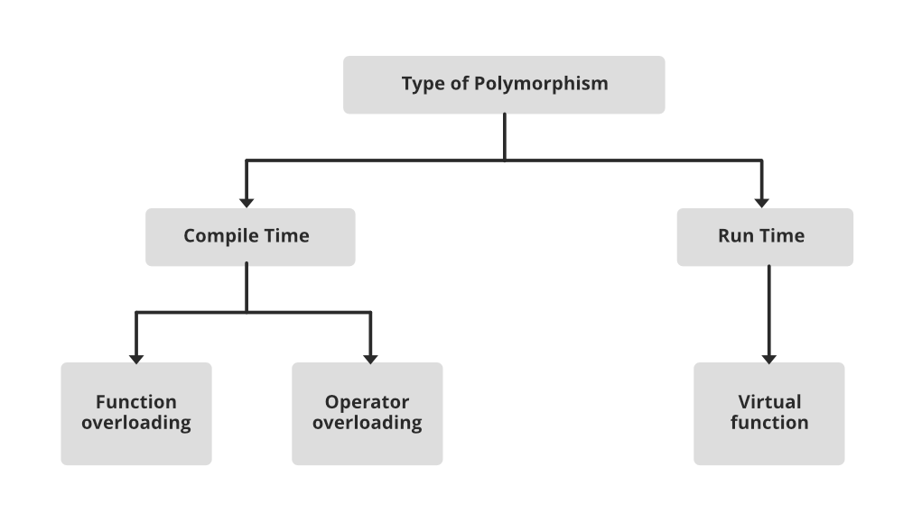

# Object-Oriented Programming (OOP) in JavaScript

Object-Oriented Programming (OOP) is a programming paradigm that organizes code into objects, promoting modularity, reusability, and maintainability. JavaScript supports OOP through prototypes and ES6 classes.

---

## OOP Concepts

OOP consists of several core principles that help in structuring and managing code efficiently. These principles include Objects and Classes, Encapsulation, Inheritance, Polymorphism, and Abstraction. Let's go through each of them in detail.

### Objects and Classes

An **object** is an instance of a class. It is a collection of properties (variables) and methods (functions) that represent real-world entities.
It is a basic unit of Object-Oriented Programming and represents the real-life entities. An Object is an instance of a Class. When a class is defined, no memory is allocated but when it is instantiated (i.e. an object is created) memory is allocated. An object has an identity, state, and behavior. Each object contains data and code to manipulate the data. Objects can interact without having to know details of each other’s data or code, it is sufficient to know the type of message accepted and type of response returned by the objects.

A **class** is a blueprint for creating objects. It defines the properties and behaviors that its objects will have.

**class** is a user-defined data type. It consists of data members and member functions, which can be accessed and used by creating an instance of that class. It represents the set of properties or methods that are common to all objects of one type. A class is like a blueprint for an object.

For Example: Consider the Class of Person. There may be many Person with different names and age but all of them will share some common properties like all of them will have greet etc. So here, Person is the class, and name, age and greet are their properties.

```js
class Person {
    constructor(name, age) {
        this.name = name;
        this.age = age;
    }

    greet() {
        console.log(
            `Hello, my name is ${this.name} and I am ${this.age} years old.`
        );
    }
}

const person1 = new Person('John', 30);
person1.greet();
```

### Encapsulation

**Encapsulation** is the bundling of data (variables) and methods (functions) that manipulate the data into a single unit (class). It helps in hiding the internal implementation and exposing only necessary parts to the outside world.

Encapsulation is defined as the wrapping up of data under a single unit. It is the mechanism that binds together code and the data it manipulates. In Encapsulation, the variables or data of a class are hidden from any other class and can be accessed only through any member function of their class in which they are declared. As in encapsulation, the data in a class is hidden from other classes, so it is also known as data-hiding.


```js
class BankAccount {
    #balance; // Private property (ES2020 feature)

    constructor(owner, balance) {
        this.owner = owner;
        this.#balance = balance;
    }

    deposit(amount) {
        this.#balance += amount;
    }

    getBalance() {
        return this.#balance;
    }
}

const account = new BankAccount('Alice', 1000);
account.deposit(500);
console.log(account.getBalance()); // 1500
```

### Inheritance

**Inheritance** allows a class (child class) to inherit properties and methods from another class (parent class). This promotes code reusability and reduces redundancy.

The capability of a class to derive properties and characteristics from another class is called Inheritance. When we write a class, we inherit properties from other classes. So when we create a class, we do not need to write all the properties and functions again and again, as these can be inherited from another class that possesses it. Inheritance allows the user to reuse the code whenever possible and reduce its redundancy.



```js
class Animal {
    constructor(name) {
        this.name = name;
    }

    makeSound() {
        console.log('Some generic sound');
    }
}

class Dog extends Animal {
    makeSound() {
        console.log('Woof Woof!');
    }
}

const myDog = new Dog('Buddy');
myDog.makeSound(); // Woof Woof!
```

### Polymorphism

**Polymorphism** means "many forms." It allows different classes to define the same method but with different implementations. This enables code flexibility and scalability.

In simple words, we can define polymorphism as the ability of a message to be displayed in more than one form. For example, A person at the same time can have different characteristics. Like a man at the same time is a father, a husband, an employee. So the same person posses different behavior in different situations. This is called polymorphism.



```js
class Bird {
    fly() {
        console.log('Flying high');
    }
}

class Penguin extends Bird {
    fly() {
        console.log('Penguins cannot fly!');
    }
}

const genericBird = new Bird();
genericBird.fly(); // Flying high

const penguin = new Penguin();
penguin.fly(); // Penguins cannot fly!
```

### Abstraction

**Abstraction** is the process of hiding complex implementation details and exposing only essential features. It helps in reducing code complexity and increasing reusability.

Abstraction is one of the most essential and important features of object-oriented programming. Data abstraction refers to providing only essential information about the data to the outside world, hiding the background details or implementation. Consider a real-life example of a man driving a car. The man only knows that pressing the accelerators will increase the speed of the car or applying brakes will stop the car, but he does not know about how on pressing the accelerator the speed is increasing, he does not know about the inner mechanism of the car or the implementation of the accelerator, brakes, etc in the car. This is what abstraction is.

```js
class Car {
    constructor(model) {
        this.model = model;
    }

    start() {
        this.#engineStart();
        console.log(`${this.model} is starting...`);
    }

    #engineStart() {
        console.log('Engine is starting internally...');
    }
}

const myCar = new Car('Tesla Model X');
myCar.start();
// Engine is starting internally...
// Tesla Model X is starting...
```

---

## OOP in JavaScript: Prototypal vs. Class-based

### a. Prototypal Inheritance

Before ES6 classes, JavaScript used prototypes for inheritance.

```js
function Person(name, age) {
    this.name = name;
    this.age = age;
}

Person.prototype.greet = function () {
    console.log(`Hello, my name is ${this.name}.`);
};

const person1 = new Person('Alice', 25);
person1.greet();
```

### b. Class-based Approach (ES6)

ES6 introduced class syntax, making OOP more structured and readable.

```js
class Person {
    constructor(name, age) {
        this.name = name;
        this.age = age;
    }

    greet() {
        console.log(`Hello, my name is ${this.name}.`);
    }
}

const person2 = new Person('Bob', 28);
person2.greet();
```

---

## Benefits of OOP in JavaScript

-   **Code Reusability**: Using inheritance, you can avoid redundant code.
-   **Encapsulation**: Keeps data safe by restricting direct access.
-   **Modularity**: Enhances maintainability and readability.
-   **Abstraction**: Hides complex logic, exposing only necessary parts.

---

## FAQs

## What is Object-Oriented Programming (OOP)?

**Answer:**
Object-Oriented Programming (OOP) is a programming paradigm based on the concept of "objects," which encapsulate data (properties) and behavior (methods). OOP helps in modularizing code, improving reusability, and making it easier to maintain.

## What are the four main principles of OOP?

**Answer:**
The four main principles of OOP are:

1. **Encapsulation** - Hiding the internal details of an object and only exposing necessary parts.
2. **Abstraction** - Showing only essential details while hiding implementation details.
3. **Inheritance** - Allowing a class to inherit properties and methods from another class.
4. **Polymorphism** - Allowing methods to take different forms (e.g., method overriding and overloading).

## What is the difference between Class and Object?

**Answer:**

-   **Class**: A blueprint or template for creating objects. It defines properties and methods.
-   **Object**: An instance of a class. It contains actual data and can invoke methods defined in the class.

## What is the difference between Abstraction and Encapsulation?

**Answer:**
| Feature | Abstraction | Encapsulation |
|----------------|------------|--------------|
| **Definition** | Hides implementation details and exposes only necessary parts. | Restricts direct access to object data and allows controlled modification. |
| **Purpose** | Reduce complexity by exposing only essential details. | Protects the integrity of data. |
| **Implementation** | Achieved using interfaces, abstract classes, or private methods. | Achieved using access modifiers (`private`, `public`). |
| **Example** | A car's steering and accelerator expose only necessary functionalities while hiding the engine's working. | The car's engine is hidden inside the hood, preventing unauthorized access. |

## What is Method Overriding in JavaScript?

**Answer:**
Method overriding occurs when a child class provides a specific implementation of a method already defined in the parent class.

Example:

```js
class Parent {
    greet() {
        console.log('Hello from Parent!');
    }
}

class Child extends Parent {
    greet() {
        console.log('Hello from Child!');
    }
}
const child = new Child();
child.greet(); // Hello from Child!
```

## What is the difference between Prototypal and Class-based OOP in JavaScript?

**Answer:**
| Feature | Prototypal Inheritance | Class-based OOP (ES6) |
|---------|----------------------|----------------------|
| **Definition** | Objects inherit directly from other objects. | Uses `class` syntax to define objects. |
| **Implementation** | Uses `Object.create()` and `prototype`. | Uses `class` and `extends`. |
| **Example** | `const obj = Object.create(protoObj);` | `class Child extends Parent {}` |
| **Flexibility** | More dynamic and flexible. | More structured and familiar. |

Example:

```js
// Prototypal Inheritance
function Person(name) {
    this.name = name;
}
Person.prototype.greet = function () {
    console.log(`Hello, my name is ${this.name}`);
};
const person1 = new Person('Alice');
person1.greet();
```

```js
// Class-based OOP
class Person {
    constructor(name) {
        this.name = name;
    }
    greet() {
        console.log(`Hello, my name is ${this.name}`);
    }
}
const person2 = new Person('Bob');
person2.greet();
```
