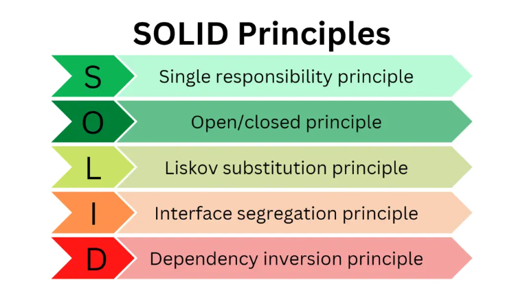

# Web Fundamentals Interview

## **Core Web Vitals & Performance Optimization**

### What are Core Web Vitals, and why are they important?

Core Web Vitals are a set of performance metrics defined by Google to measure user experience on the web. They focus on loading speed, interactivity, and visual stability. These vitals impact search rankings and overall user engagement.

### What is Largest Contentful Paint (LCP), and how can you improve it?

LCP measures how long it takes for the largest visible element on the page to load. To improve LCP:

-   Optimize images with compression and modern formats (WebP, AVIF)
-   Use a Content Delivery Network (CDN)
-   Minimize render-blocking resources
-   Optimize server response times

### How does First Input Delay (FID) impact user experience?

FID measures the time between a user’s first interaction (click, tap, key press) and the browser’s response. A high FID indicates sluggish interactivity. To improve FID:

-   Reduce JavaScript execution time
-   Use web workers to offload tasks
-   Defer non-essential scripts

### What is Cumulative Layout Shift (CLS), and how can you prevent it?

CLS quantifies unexpected layout shifts that occur during page load. To minimize CLS:

-   Set explicit width and height for images and iframes
-   Use CSS animations instead of layout shifts
-   Reserve space for dynamically loaded content

### What tools can you use to measure and optimize Core Web Vitals?

-   Google Lighthouse
-   PageSpeed Insights
-   WebPageTest
-   Chrome DevTools Performance Panel

### How does lazy loading improve web performance?

Lazy loading defers loading of non-essential resources (e.g., images, iframes) until they are needed, reducing initial page load time and improving user experience.

### What are the differences between server-side rendering (SSR) and client-side rendering (CSR)?

-   **SSR**: HTML is generated on the server and sent to the client, improving SEO and initial load time.
-   **CSR**: The client fetches a blank HTML file and JavaScript builds the UI dynamically. Better for interactive applications.

### What are some common causes of render-blocking resources, and how can they be fixed?

-   Large CSS and JavaScript files
-   Slow-loading fonts
-   Unoptimized third-party scripts
    To fix:
-   Minify and compress CSS/JS
-   Use async/defer attributes for JavaScript
-   Load fonts efficiently

### How does browser caching work, and how can it improve performance?

Browser caching stores frequently accessed assets locally to prevent redundant downloads. Use cache-control headers and versioning strategies to optimize caching.

### What are the advantages of using a Content Delivery Network (CDN)?

-   Faster content delivery by serving resources from geographically closer servers
-   Load balancing and DDoS protection
-   Reduces server load and bandwidth usage

## **SOLID Principles & Software Design**

### What are the SOLID principles in software development?

SOLID principles are guidelines for writing maintainable and scalable code:

-   **S**ingle Responsibility Principle
-   **O**pen/Closed Principle
-   **L**iskov Substitution Principle
-   **I**nterface Segregation Principle
-   **D**ependency Inversion Principle

    

### How does the Single Responsibility Principle (SRP) improve code maintainability?

SRP states that a class should have only one reason to change. It improves readability, reduces dependencies, and simplifies debugging.

### What is the Open/Closed Principle (OCP), and how do you apply it in JavaScript/TypeScript?

OCP states that classes should be open for extension but closed for modification. Use interfaces, inheritance, and polymorphism to extend functionality without altering existing code.

### Explain the Liskov Substitution Principle (LSP) with an example.

LSP ensures that subclasses can replace parent classes without affecting program behavior. Example:

```typescript
class Bird {
    fly() {}
}
class Penguin extends Bird {
    fly() {
        throw new Error('Penguins cannot fly');
    }
}
// Violates LSP since Penguin cannot fly like other birds
```

### How does applying SOLID principles improve testability in an application?

By following SOLID principles, code is modular, loosely coupled, and easy to mock, making unit testing simpler and more reliable.

## **Web Accessibility & SEO**

### What is web accessibility (a11y), and why is it important?

Web accessibility ensures that websites can be used by people with disabilities, improving inclusivity and compliance with legal standards (e.g., WCAG).

### What is semantic HTML, and why is it crucial for accessibility and SEO?

Semantic HTML uses meaningful tags (`<header>`, `<article>`, `<nav>`) to improve readability, accessibility, and SEO ranking.

### What are structured data and schema markup, and how do they help with SEO?

Structured data provides search engines with detailed information about content, improving search rankings and rich results (e.g., FAQs, reviews).

## **Security & Best Practices**

### What are some common web security vulnerabilities?

-   Cross-Site Scripting (XSS)
-   Cross-Site Request Forgery (CSRF)
-   SQL Injection
-   Clickjacking

### How can you prevent Cross-Site Scripting (XSS) attacks?

-   Sanitize user input
-   Use Content Security Policy (CSP)
-   Escape output in HTML templates

### What is CORS, and how does it impact web applications?

Cross-Origin Resource Sharing (CORS) controls how resources are shared between different origins to prevent unauthorized access.

### What are some best practices for managing API security?

-   Use authentication and authorization (OAuth, JWT)
-   Implement rate limiting
-   Encrypt sensitive data
